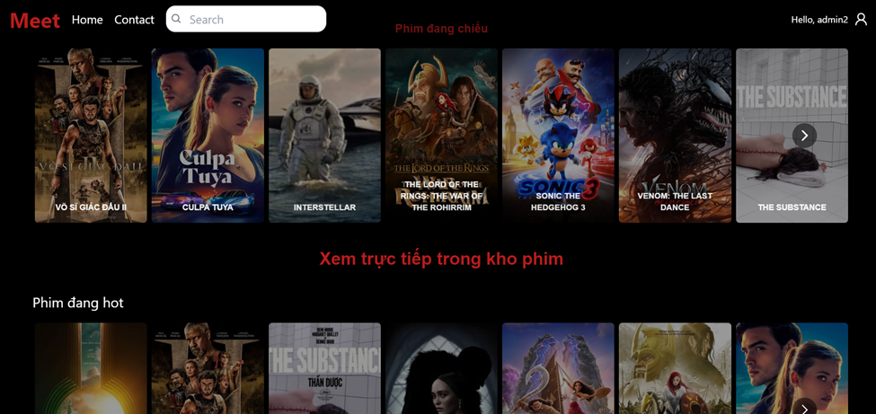
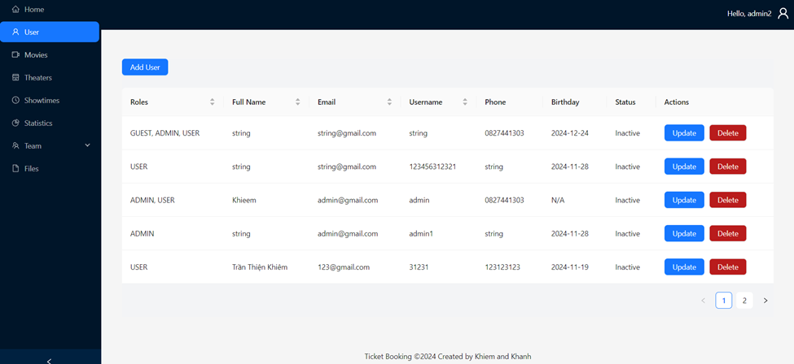
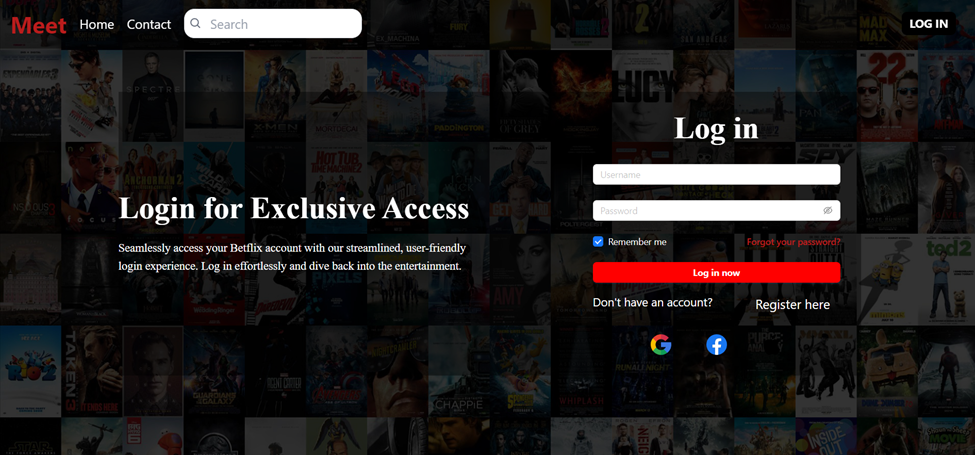

# Meetflix Web

## Introduction

Meetflix Web is the frontend of a cinema management project for SE121 at UIT. This project provides an interactive and dynamic interface for users to browse movies, book tickets, and manage cinema-related activities. The system consists of three roles: User, Manager, and Admin.

## Project Roles and Features

### 🎬 User Role:

- Browse movies, view details, and watch trailers.
- Book tickets for available showtimes.
- Make secure payments.
- View schedules and upcoming movies.



### 🎥 Manager Role:

- Manage cinema screening schedules.
- Oversee seat availability and bookings.
- Control movie listings and showtimes.


### 🔧 Admin Role:

- Manage user accounts.
- Oversee system-wide configurations.
- Maintain data consistency and security.



## 🔗 Backend Service

This frontend application communicates with the Meetflix backend, which follows a microservices architecture. You can find the backend repository here: [Meetflix Backend](https://github.com/khanhqueng/meetflix)

## 📂 Project Structure

```
Meetflix-Web/
│-- api/                 # API service integration
│-- assets/              # Static assets (images, icons, etc.)
│-- components/          # Reusable UI components
│-- context/             # Global state management
│-- hooks/               # Custom React hooks
│-- pages/               # Application pages
│-- App.jsx              # Main App component
│-- index.css            # Global styles
│-- main.jsx             # Application entry point
│-- .env                 # Environment variables
```

## 🛠️ Tech Stack

Meetflix Web is built using the following technologies and libraries:

- **React.js** - A JavaScript library for building user interfaces.
- **Tailwind CSS** - A utility-first CSS framework for rapid UI development.
- **Ant Design** - A UI component library for creating elegant and functional interfaces.
- **React Query** - For efficient data fetching and state management.
- **Zalo Pay Integration** - Enables secure online payments.
- **Vite** - A fast development server and build tool.
- **SWR** - A lightweight data-fetching library for remote data handling.

## 🚀 Setup & Installation

### 1️⃣ Clone the Repository

```bash
git clone https://github.com/Marethy/Movie-Trailer.git
cd Movie-Trailer
```

### 2️⃣ Set Up Environment Variables

Create a `.env` file in the root directory and add the required API keys:

```bash
VITE_API_KEY=your_tmdb_api_key_here
```

### 3️⃣ Install Dependencies

```bash
npm install
```

### 4️⃣ Run the Development Server

```bash
npm run dev
```

### 5️⃣ Build for Production

```bash
npm run build
```

### 6️⃣ Preview the Production Build

```bash
npm run preview
```

## 🎯 Additional Scripts

- **Lint Code:**
  ```bash
  npm run lint
  ```
- **Format Code:**
  ```bash
  npm run format
  ```

## 📸 Demo Screenshots

### 🔐 Login Page


### 🎬 Movie List


### 🛠 Admin Dashboard


### 🎟 Select Seat


## 🏆 **Final Score**

🚀 **This project received a perfect score of 9.5/10 in the SE121 course at UIT!** 🎖

## 🤝 Contributions

We welcome contributions! Feel free to open an issue or submit a pull request.

## 📜 License

This project is licensed under the MIT License.

